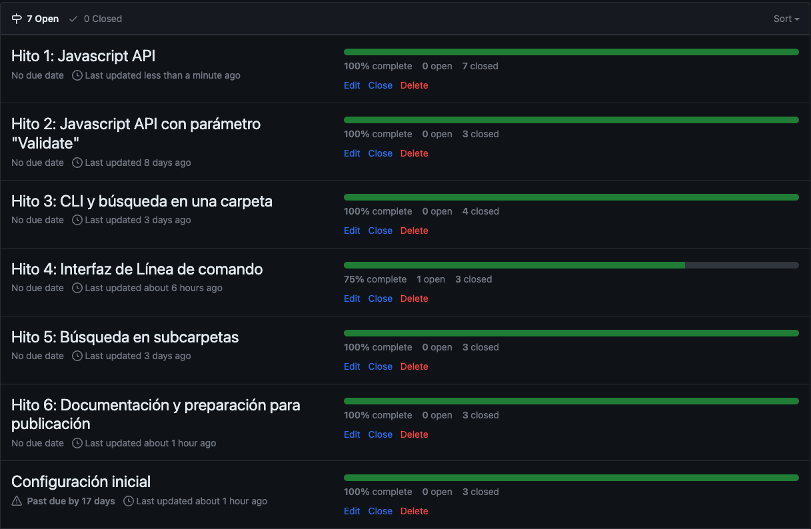

<p align="center">
  
</p>

## Descripción

* [1. Introducción](#1-introducción)
* [2. Instalación](#2-instalación)
* [3. Uso básico](#3-uso-básico)
* [4. Opciones avanzadas](#4-opciones-avanzadas)
* [5. Arquitectura y tecnologías](#5-arquitectura-y-tecnologías)
* [6. Proceso de desarrollo](#6-proceso-de-desarrollo)
* [7. Contactos y enlaces](#7-contactos-y-enlaces)

***

## 1. Introducción

mdLinks es una API desarrollada en **node.js** para buscar y extraer enlaces dentro de archivos Markdown (.md) y proporcionar diversas opciones para que los usuarios puedan trabajar con ellos de manera efectiva. Los archivos Markdown son comúnmente utilizados para la creación de documentos que incluyen enlaces a otros recursos, y con esta herramienta, el proceso de extracción y manipulación de enlaces se vuelve más sencillo y eficiente.

### Características principales

La API mdLinks ofrece varias funcionalidades esenciales para el manejo de enlaces en archivos Markdown:

1. **Búsqueda de enlaces:** mdLinks escanea de manera inteligente los archivos Markdown y recopila todos los enlaces encontrados, proporcionando una lista completa.

2. **Validación de estado:** Con mdLinks, puedes verificar el estado de cada enlace encontrado. Esto significa que la API realiza solicitudes HTTP para comprobar si los enlaces siguen activos y si existen problemas de conectividad.

3. **Estadísticas de enlaces:** Además de encontrar y validar enlaces, mdLinks proporciona estadísticas precisas sobre la cantidad de enlaces totales presentes.

4. **Lectura de directorios:** mdLinks tiene la capacidad de leer directorios, lo que permite encontrar y analizar archivos Markdown en múltiples ubicaciones. Esto facilita el procesamiento de grandes cantidades de archivos y la gestión eficiente de enlaces en proyectos complejos.

5. **Facilidad de uso:** La API se presenta con una interfaz sencilla y fácil de utilizar. Con comandos simples, los usuarios pueden obtener rápidamente los resultados deseados sin complicaciones innecesarias.


## 2. Instalación

Para instalar la API mdLinks, el usuario debe seguir los siguientes pasos:

1. Abrir una terminal o línea de comandos en el proyecto donde se desea utilizar la API.

2. Ejecutar el siguiente comando de npm para realizar la instalación desde npm:

```bash
npm i mdlinks-mafeorostegui
```

## 3. Uso básico

El uso básico de la API `mdLinks` es sencillo y se realiza ejecutando el siguiente comando en la terminal:

```bash
mdlinks linktest.md
```

Donde `linktest.md` es el nombre del archivo que se desea evaluar. Al ejecutar este comando, la API buscará los enlaces presentes en el archivo *markdown* y mostrará en la consola cada uno de ellos, junto con el texto que los acompaña y la ruta de su ubicación. De esta manera, el usuario obtendrá una visión detallada de los enlaces contenidos en el archivo analizado:

```bash
 🏆 Links found: [
  {
    href: 'https://openai.com',
    text: 'OpenAI',
    file: '/Users/Documents/linktest.md'
  },
  {
    href: 'https://github.com',
    text: 'GitHub',
    file: '/Users/Documents/linktest.md'
  }
]

```
Además, la versatilidad de la API permite realizar búsquedas en carpetas, lo cual resulta especialmente útil para analizar múltiples archivos markdown a la vez. Al emplear el siguiente comando:

```bash
mdlinks carpeta_ejemplo
```
La API recorrerá la carpeta especificada, examinando cada archivo markdown presente en ella y extrayendo sus enlaces. A continuación, se muestra un ejemplo del resultado de esta búsqueda:

```bash
 🏆 Links found: [
  {
    href: 'https://www.google.com',
    text: 'Google',
    file: '/Users/Documents/carpeta_ejemplo/file1.md'
  },
  {
    href: 'https://www.wikipedia.org',
    text: 'Wikipedia',
    file: '/Users/Documents/carpeta_ejemplo/file2.md'
  }
]
```
En este ejemplo, la API ha encontrado tres enlaces en dos archivos markdown diferentes dentro de la carpeta carpeta_ejemplo. Para cada enlace, se muestran detalles como la URL (href), el texto del enlace (text) y la ruta completa del archivo donde se encuentra el enlace (file). Esta información permite al usuario identificar rápidamente los enlaces y conocer su ubicación en los archivos, facilitando cualquier acción o análisis necesario.

Si el archivo o carpeta especificada no existe o el path es incorrecto, la API mostrará un mensaje de error indicando la razón del fallo, lo que ayuda al usuario a corregir posibles errores en los comandos de ejecución. Los mensajes de error serían similares a los siguientes:

- Ejemplo 1:

```bash
 💥 This path does not exist, enter a valid path
```
- Ejemplo 2:
```bash
 💥 You should enter a path valid. 
Please enter to a path to a file or a folder
```
En caso de que no se encuentren enlaces en el archivo markdown o no haya ningún archivo markdown dentro de la carpeta especificada, la API mostrará el siguiente mensaje:

- Ejemplo 1:

```bash
 💥 There are no links in this path, enter another one
```

- Ejemplo 2:
```bash
 💥 No markdown files found at this path, please enter another
```
De esta manera, la API proporciona información útil sobre los enlaces encontrados y también maneja de forma adecuada las situaciones de error, garantizando una experiencia de uso más amigable y esclarecedora para el usuario.


## 4. Opciones avanzadas

La API `mdLinks` ofrece opciones avanzadas que permiten al usuario realizar acciones adicionales durante la búsqueda y validación de enlaces en archivos markdown. Estas opciones se pueden especificar al ejecutar el comando en la terminal.

A continuación se describen las opciones disponibles y cómo el usuario puede utilizarlas:

### Opción `--validate`

La opción `--validate` permite validar el estado de los enlaces encontrados en el archivo markdown. Para utilizar esta opción, el usuario debe ejecutar el siguiente comando:

```bash
mdlinks example.md --validate
```

Al utilizar la opción `--validate`, la API recorrerá el archivo `example.md`, buscará los enlaces presentes y, además, verificará la disponibilidad de cada enlace en línea. La consola mostrará detalles sobre cada enlace, incluyendo la URL, el texto asociado, la ruta del archivo y su estado (activo o roto):

```bash
 🏆 Links found: [
  {
    href: 'https://openai.com',
    text: 'OpenAI',
    file: '/Users/Documents/linktest.md',
    status: 403,
    statusText: 'fail',
  },
  {
    href: 'https://github.com',
    text: 'GitHub',
    file: '/Users/Documents/linktest.md'
    status: 200,
    statusText: 'OK',
  }
]
```

### Opción `--stats`

La opción `--stats` permite obtener estadísticas sobre los enlaces encontrados en el archivo markdown, sin realizar la validación de su estado. Para utilizar esta opción, el usuario debe ejecutar el siguiente comando:

```bash
mdlinks example.md --stats
```

Al utilizar la opción `--stats`, la API recorrerá el archivo `example.md`, buscará los enlaces presentes y mostrará en la consola información estadística sobre ellos. Esta información incluye la cantidad total de enlaces encontrados y la cantidad de enlaces únicos, es decir, aquellos que no se repiten en el archivo:

```bash
Statistics for links in example.md { Total: 2, Unique: 2 }
```

### Opciones `--stats` y `--validate` juntas

El usuario también puede combinar las opciones `--stats` y `--validate` para obtener estadísticas detalladas que incluyan la validación del estado de los enlaces. Para utilizar ambas opciones, el usuario debe ejecutar el siguiente comando:

```bash
mdlinks example.md --stats --validate
```

Al combinar estas opciones, la API realizará la búsqueda de enlaces, mostrará las estadísticas totales y de enlaces únicos, y además, validará cada enlace en línea, proporcionando información sobre su estado (activo o roto):

```bash
Statistics for verified links in example.md { Total: 2, Unique: 2, Broken: 1 }
```

Estas opciones avanzadas brindan al usuario una mayor flexibilidad y control al utilizar la API `mdLinks`.

## 5. Arquitectura y Tecnologías

La API `mdLinks` está construida en Node.js, aprovechando su enfoque asíncrono y su capacidad para trabajar con el sistema de archivos. Esta elección permite una gestión eficiente de lectura y búsqueda en archivos markdown, así como la extracción de enlaces.

### Tecnologías utilizadas:

A continuación, se detallan las principales tecnologías que forman parte de la API `mdLinks`:

1. **Node.js:** Es un entorno de tiempo de ejecución de JavaScript que permite ejecutar código JavaScript en el servidor y utilizar módulos y paquetes para ampliar la funcionalidad de la aplicación.

2. **JavaScript:** Lenguaje de programación ampliamente utilizado en el desarrollo web, que proporciona la lógica y funcionalidad principal de la API.

3. **File System (fs) Module:** Un módulo de Node.js que proporciona una API para interactuar con el sistema de archivos, permitiendo leer y escribir archivos.

4. **Path Module:** Otro módulo de Node.js que proporciona utilidades para trabajar con rutas de archivos y directorios. Se utiliza para obtener rutas absolutas y relativas, así como para manipular las rutas de los archivos analizados.

5. **axios:** Una librería JavaScript basada en promesas que se utiliza para realizar solicitudes HTTP, lo que permite validar los enlaces encontrados en los archivos markdown.

6. **Jest:** Jest es un popular framework de pruebas para JavaScript que se utilizó para implementar las pruebas unitarias de la API. Proporciona un entorno de pruebas completo y eficiente, permitiendo realizar pruebas de forma rápida y sencilla.

7. **gradient-string:** Esta librería de Node.js se utiliza para generar gradientes de colores en la consola, lo que mejora la presentación y experiencia visual al mostrar los resultados de la API.

El uso de `gradient-string` agrega un toque estético a la presentación de resultados en la consola, mejorando la experiencia del usuario al interactuar con la API.

## 6. Proceso de desarrollo

El desarrollo de la API `mdLinks` siguió un proceso organizado y estructurado para garantizar la calidad y funcionalidad del producto final. A continuación, se describen las etapas clave del proceso de desarrollo:

1. **Definición de Requisitos:** En esta etapa inicial, se definieron los requisitos y funcionalidades que debía cumplir la API. Se identificaron las principales características, como la búsqueda de enlaces en archivos markdown, la validación del estado de los enlaces y la generación de estadísticas.

2. **Diseño de la Arquitectura:** Se diseñó la arquitectura general de la API, definiendo los módulos y componentes necesarios para su funcionamiento. Se tomó la decisión de utilizar CommonJS para el desarrollo.

3. **Implementación Mayoritariamente con Promesas:** Durante la implementación, se hizo un esfuerzo por utilizar en su mayoría promesas para gestionar las operaciones asíncronas. Esto permitió un código más legible y mantenible.

4. **Pruebas Unitarias con Uso de Mock:** Se llevaron a cabo pruebas unitarias para asegurar el correcto funcionamiento de cada módulo y funcionalidad. Para ello, se utilizaron mocks para simular algunos escenarios y garantizar que la API respondiera adecuadamente a diversas situaciones.

5. **Diagrama de Flujo del Funcionamiento de la API:** A continuación, se presenta el diagrama de flujo que muestra el funcionamiento general de la API `mdLinks`:

[Diagrama de flujo](https://www.figma.com/file/weIHe2P4RsK9SNrlm5TVNu/Diagrama-de-flujo?type=whiteboard&node-id=0%3A1&t=tbWppajXoc5iTwpR-1)

6. **Planeación en GitHub Projects:** Para una gestión efectiva del desarrollo, se utilizó GitHub Projects, donde se definieron 6 milestones con el paso a paso del desarrollo. Cada milestone representó una etapa del proceso de desarrollo y se crearon tarjetas para cada funcionalidad o tarea. Estas tarjetas se organizaron en columnas según su estado (por hacer, en progreso, completadas, etc.), lo que permitió un seguimiento detallado y una distribución eficiente de las responsabilidades entre el equipo de desarrollo.




El proceso de desarrollo de la API `mdLinks` se realizó de manera iterativa y colaborativa con mis compañeras, permitiendo una mejora continua y la incorporación de retroalimentación. 

## 7. Contactos y Enlaces

Para cualquier consulta, sugerencia o reporte de problemas relacionados con la API mdLinks, los usuarios pueden ponerse en contacto con la desarrolladora a través de los siguientes medios:

- **Correo electrónico:** Se proporciona una dirección de correo electrónico, `mfop001new@gmail.com`, para recibir asistencia personalizada y resolver dudas.


- **Repositorio en GitHub:** [https://github.com/MafeOrostegui/DEV009-md-links](https://github.com/MafeOrostegui/DEV009-md-links)

